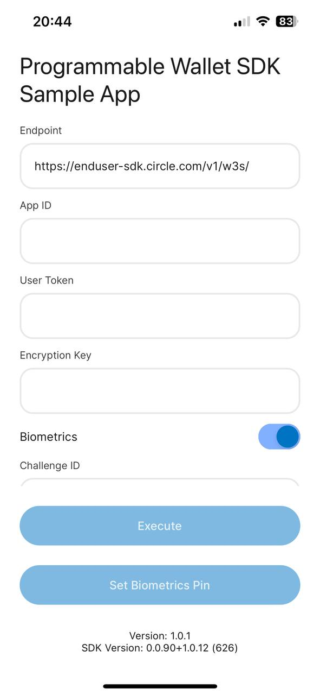

# Circle Programmable Wallet SDK for React Native - Sample

> Sample app for integrating Circle Programmable Wallet React Native SDK.

- Bookmark
  - [Requirement](#requirement)
  - [Authenticate the npm registry](#authenticate-the-npm-registry)
  - [Installation](#installation)
  - [New Architecture Support](#new-architecture-support)
  - [Run the Sample App](#requirement)
---


## Requirement
### Android
- Java 17 is required for the sample app.
### iOS
- Xcode 14.1+    
Install Apple’s Xcode development software: [Xcode in the Apple App Store](https://apps.apple.com/tw/app/xcode/id497799835?mt=12).

- CocoaPods    
**CocoaPods** is a dependency manager for iOS projects. [Install CocoaPods by Homebrew](https://formulae.brew.sh/formula/cocoapods). (suggestion)    
  > Check if Homebrew is installed:

  ```shell
  $ brew
  ```

  > How to install Homebrew on MacOS: [Link](https://mac.install.guide/homebrew/3.html)

## Authenticate the npm registry

Create a Personal Access Token (PAT) in your [GitHub setting](https://github.com/settings/tokens). Use the `Configure SSO` button next to your created token to authorize `circlefin` organization. More instructions can be found [here](https://docs.github.com/en/authentication/keeping-your-account-and-data-secure/managing-your-personal-access-tokens), and check below links for creating GitHub PAT:
- [Creating a fine-grained personal access token](https://docs.github.com/en/authentication/keeping-your-account-and-data-secure/managing-your-personal-access-tokens#creating-a-fine-grained-personal-access-token)
- [Creating a personal access token (classic)](https://docs.github.com/en/authentication/keeping-your-account-and-data-secure/managing-your-personal-access-tokens#creating-a-personal-access-token-classic)
    

## Installation
```shell
yarn add @circle-fin/w3s-pw-react-native-sdk
```
### Android
Add the maven repository to your `android/build.gradle`. It's suggested that load settings from the `local.properties`:
```properties
repositories {
	...
	maven {
        	Properties properties = new Properties()
		// Load local.properties.
        	properties.load(new File(rootDir.absolutePath + "/local.properties").newDataInputStream())

		url properties.getProperty('pwsdk.maven.url')
		credentials {
        		username properties.getProperty('pwsdk.maven.username')
        		password properties.getProperty('pwsdk.maven.password')
		}
	}
}
```
Add the maven setting values in the `local.properties` file.
```properties
pwsdk.maven.url=https://maven.pkg.github.com/circlefin/w3s-android-sdk
pwsdk.maven.username=<GITHUB_USERNAME>
pwsdk.maven.password=<GITHUB_PAT>
```
> **Note**
> When pasting the values above for `<GITHUB_USERNAME>` and `<GITHUB_PAT>`, make sure to not surround the values with quotes.
### iOS
Run the command under `ios/`:
```
pod install
```
## New Architecture Support
The SDK is supporting both React Native old and [new architectures](https://reactnative.dev/docs/the-new-architecture/landing-page).
You can enable or disable the new architecture by changing the project setting.
### Android
Set the `android/gradle.properties` file as below to enable new architecture or false to disable. 
```properties
newArchEnabled=true
```
### iOS
Reinstall your pods by running pod install with the right flag:
```shell
bundle install && RCT_NEW_ARCH_ENABLED=1 bundle exec pod install
```
Or run without flag to use old architecture:
```sh
pod install
```
## Run the Sample App
1. Edit `src/config.json` ➜ `pw_app_id` to fill in your `APP ID`.
2. (Optional) Open the project in [Android Studio](https://developer.android.com/studio) and see if there's any build error.
    - File ➜ Open ➜ choose `android` folder.
    - File ➜ Sync Project with Files.
    - Build ➜ Rebuild Project.
3. (Optional) Open the project in [Xcode](https://apps.apple.com/tw/app/xcode/id497799835?mt=12) and build to see if there's any build error.
    - Open `W3sSampleWallet.xcworkspace` in Xcode.
    - Product ➜ Build.
4. Run on device  
    You can simply run the command below or find more detail on [reactnative.dev](https://reactnative.dev/docs/running-on-device?package-manager=yarn&platform=android).
      - Android
        ```sh
        yarn android
        ```
      - iOS
        ```sh
        yarn ios
        ```
    

 5. Fill in the `App ID` and execute it along with `User Token`, `Encryption Key` and `Challenge ID`.    

