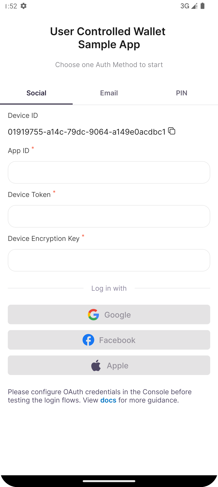
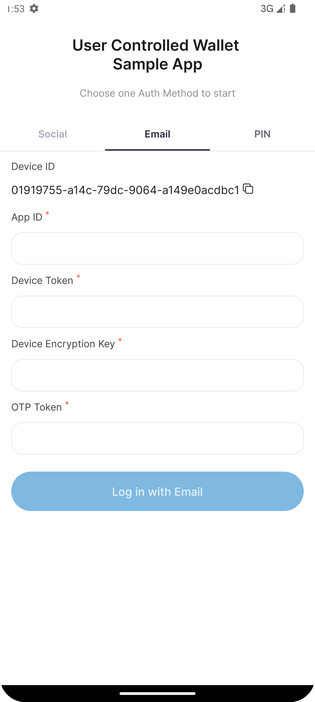
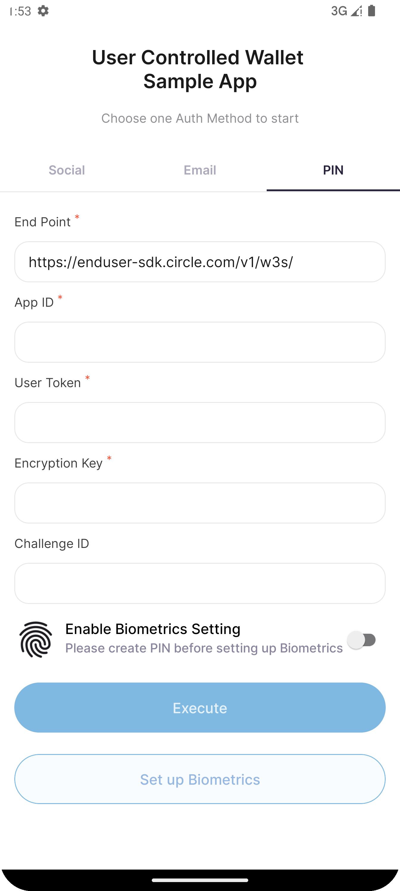

# Circle Programmable Wallet SDK for React Native - Sample

> Sample app for integrating Circle Programmable Wallet React Native SDK.

- Bookmark
  - [Requirement](#requirement)
  - [Installation](#installation)
  - [New Architecture Support](#new-architecture-support)
  - [Run the Sample App](#requirement)
---


## Requirement
### Android
- Java 17 is required for the sample app.
### iOS
- Xcode 14.1+    
Install Apple’s Xcode development software: [Xcode in the Apple App Store](https://apps.apple.com/tw/app/xcode/id497799835?mt=12).

- CocoaPods    
**CocoaPods** is a dependency manager for iOS projects. [Install CocoaPods by Homebrew](https://formulae.brew.sh/formula/cocoapods). (suggestion)    
  > Check if Homebrew is installed:

  ```shell
  $ brew
  ```

  > How to install Homebrew on MacOS: [Link](https://mac.install.guide/homebrew/3.html)
  
## Installation
```shell
yarn add @circle-fin/w3s-pw-react-native-sdk
```
### Android
1. In your root-level (project-level) Gradle file (`android/build.gradle`)
    1. Add the maven repository as below. It's suggested that load settings from the `local.properties`:
        ```properties
        repositories {
            ...
            maven {
                    Properties properties = new Properties()
                // Load local.properties.
                    properties.load(new File(rootDir.absolutePath + "/local.properties").newDataInputStream())
        
                url properties.getProperty('pwsdk.maven.url')
                credentials {
                        username properties.getProperty('pwsdk.maven.username')
                        password properties.getProperty('pwsdk.maven.password')
                }
            }
        }
        ```
    2. Add the Google services plugin as a dependency:
        ```
       buildscript {
           dependencies {
               classpath 'com.google.gms:google-services:4.4.2'
           }
       }
        ```
2. In your module (app-level) Gradle file (`android/app/build.gradle`), add the Google services plugin:
    ```
    apply plugin: "com.google.gms.google-services"
    ```

3. Add the maven setting values in the `local.properties` file.
    ```properties
    pwsdk.maven.url=https://maven.pkg.github.com/circlefin/w3s-android-sdk
    pwsdk.maven.username=<GITHUB_USERNAME>
    pwsdk.maven.password=<GITHUB_PAT>
    ```
   > **Note**
   > When pasting the values above for `<GITHUB_USERNAME>` and `<GITHUB_PAT>`, make sure to not surround the values with quotes.

   - Check the following links for creating PAT.
       - [Creating a personal access token (classic)](https://docs.github.com/en/authentication/keeping-your-account-and-data-secure/managing-your-personal-access-tokens#creating-a-personal-access-token-classic)
       - [Creating a fine-grained personal access token](https://docs.github.com/en/authentication/keeping-your-account-and-data-secure/managing-your-personal-access-tokens#creating-a-fine-grained-personal-access-token)
### iOS
Run the command under `ios/`:
```
pod install
```
## New Architecture Support
The SDK is supporting both React Native old and [new architectures](https://reactnative.dev/docs/the-new-architecture/landing-page).
You can enable or disable the new architecture by changing the project setting.
### Android
Set the `android/gradle.properties` file as below to enable new architecture or false to disable. 
```properties
newArchEnabled=true
```
### iOS
Reinstall your pods by running pod install with the right flag:
```shell
bundle install && RCT_NEW_ARCH_ENABLED=1 bundle exec pod install
```
Or run without flag to use old architecture:
```sh
pod install
```
## Run the Sample App
### Android
1. Edit `src/config.json` ➜ `pw_app_id` to fill in your `APP ID`.
2. Place your `google-services.json` file downloaded from Firebase to `android/app` [(LearnMore)](https://github.com/react-native-community/react-native-google-signin/blob/master/docs/get-config-file.md)
3. **_Skip this if not using Google sign-in_**  
    Edit `android/app/src/main/res/values/strings.xml` ➜ `YOUR_GOOGLE_WEB_CLIENT_ID` to fill in your `Google sign-in client ID`.
4. **_Skip this if not using Facebook sign-in_**  
    Edit `android/app/src/main/res/values/strings.xml` ➜ `YOUR_FACEBOOK_APP_ID` to fill in your `Facebook app id`.  
    Edit `android/app/src/main/res/values/strings.xml` ➜ `YOUR_FACEBOOK_CLIENT_TOKEN` to fill in your `Facebook client token`.
5. **_Skip this if not using Apple sign-in_**  
    Edit `android/app/build.gradle` ➜ `YOUR_APPLE_SERVICE_ID` to fill in your `Apple service-id`.  
6. (Optional) Open the project in [Android Studio](https://developer.android.com/studio) and see if there's any build error.
    - File ➜ Open ➜ choose `android` folder.
    - File ➜ Sync Project with Files.
    - Build ➜ Rebuild Project.
7. Run on device  
   You can simply run the command below or find more detail on [reactnative.dev](https://reactnative.dev/docs/running-on-device?package-manager=yarn&platform=android).
    - Android
      ```sh
      yarn android
      ```
### iOS
1. Edit `src/config.json` ➜ `pw_app_id` to fill in your `APP ID`.
2. Open the project in [Xcode](https://apps.apple.com/tw/app/xcode/id497799835?mt=12) and build to see if there's any build error.
    - Open `W3sSampleWallet.xcworkspace` in Xcode.
    - Product ➜ Build.
    - If the Metro server does not launch by Xcode, please run the command on project folder.
      ```sh
      yarn start
      ```
3. Social login setups
   - **_Apple sign-in (Optional)_**  
     In the project editor, setup your own development team and Bundle Identifier.  
     Add the Sign In with Apple capability to your target if needed.  
      > Learn more: https://help.apple.com/xcode/mac/11.0/#/dev50571b902
   
   - **_Google sign-in (Optional)_**  
    Edit `W3sSampleWallet/info.plist` ➜ `YOUR_IOS_CLIENT_ID` to fill in your `OAuth client ID`.  
    Edit `W3sSampleWallet/info.plist/URL types/URL Schemes` ➜ `YOUR_DOT_REVERSED_IOS_CLIENT_ID` to fill in your `reversed client ID`.  
      > Learn more: https://developers.google.com/identity/sign-in/ios/start-integrating?hl=en#add_client_id

   - **_Facebook sign-in (Optional)_**  
    Edit `W3sSampleWallet/info.plist/URL types/URL Schemes` ➜ `fbAPP-ID` replace with `fb{your-facebook-app-id}`.  
    Edit `W3sSampleWallet/info.plist/FacebookAppID` ➜ `APP-ID` replace with `your-facebook-app-id`.  
    Edit `W3sSampleWallet/info.plist/FacebookClientToken` ➜ `CLIENT-TOKEN` to fill in your `Facebook client token`.  
    Edit `W3sSampleWallet/info.plist/FacebookDisplayName` ➜ `APP-NAME` to fill in your `App Name`.  
      > Learn more: https://developers.facebook.com/docs/ios/getting-started#configure-your-project

4. Run on device  
    You can simply run the command below or find more detail on [reactnative.dev](https://reactnative.dev/docs/running-on-device?package-manager=yarn&platform=android).
      - iOS
        ```sh
        yarn ios
        ```
    
### Usage
There are three tabs corresponding to different [authentication methods](https://developers.circle.com/w3s/docs/authentication-methods). 
    Fill in the `App ID` and the relevant fields in each tab according to the requirements of different authentication methods for challenge execution.  

&nbsp;&nbsp;
