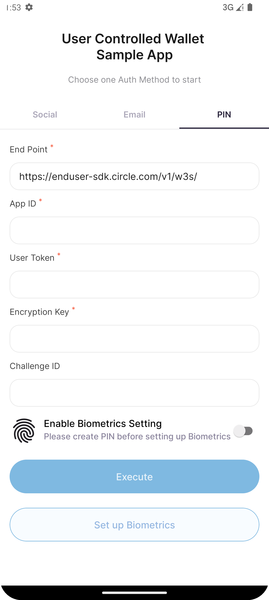
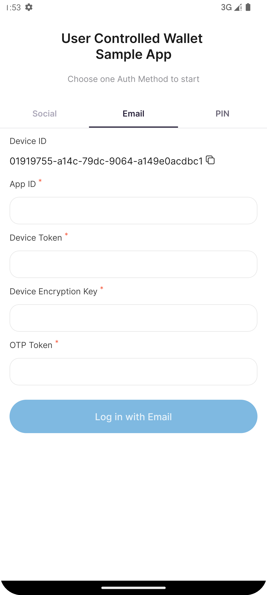
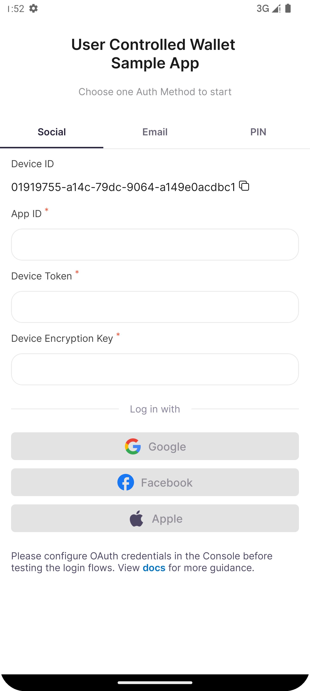

# Circle User-Controlled Wallets React Native Sample App

> Expo sample app demonstrating Circle's user-controlled wallet integration using React Native SDK

This sample app supports three authentication methods:

&nbsp;&nbsp;&nbsp;&nbsp;

### 1. PIN Code (Recommended for quick start)
- **Simplest setup** - Only requires Circle App ID

### 2. Email OTP
- **Backend configuration** - Requires email service setup on Circle developer console
- No additional client-side configuration needed

### 3. Social Login (Google, Facebook, Apple)
- **Advanced setup** - Requires OAuth provider accounts and platform-specific configuration
- Additional setup for iOS and Android

---

## Table of Contents

- [Requirements](#requirements)
- [Quick Start (PIN Mode)](#quick-start-pin-mode)
- [Email OTP Setup](#email-otp-setup)
- [Social Login Setup](#social-login-setup)
- [Troubleshooting](#troubleshooting)
- [Migrating from SDK v1](#migrating-from-sdk-v1-bare-react-native)

---

## Requirements

### Development Environment
- Node.js 20.19.4 or higher
- npm
- Expo CLI

### Android
- Java 17 (JDK 17 recommended)
- Android Studio and Android SDK
- Android SDK Platform 35 (Android 15 VanillaIceCream)
- Android SDK Build-Tools 36.0.0
- Android device or emulator (API level 35+)

### iOS
- macOS with Xcode 16.1+ (Xcode 26 is recommended)
- Xcode Command Line Tools
- CocoaPods
- iOS device (iOS 15.0+) or Simulator
- Apple Developer account (for physical device testing)

---

## Quick Start (PIN Mode)

### Prerequisites
1. **Circle Developer Console Account** - [Sign up here](https://console.circle.com)
2. **App ID** - Get from [Circle Developer Console](https://console.circle.com/wallets/user/configurator) → Wallets → User Controlled → Configurator
3. **GitHub PAT** (Android only) - [Create token](https://github.com/settings/tokens) with `read:packages` permission

### Install and Run

**Step 1: Install dependencies**

```bash
npm install
```

**Step 2: Configure .env (Android only)**

```bash
cp .env.example .env
```

Edit `.env` and add your `PWSDK_MAVEN_USERNAME` and `PWSDK_MAVEN_PASSWORD`

**Step 3: Configure App ID**

Edit `src/config.json` and set your App ID:

```json
{
  "pw_app_id": "YOUR_APP_ID"
}
```

**Step 4: Generate native projects**

```bash
npx expo prebuild
```

**Step 5: Run the app**

For iOS:
```bash
npm run ios
```

For Android:
```bash
npm run android
```

**That's it!** Open the app, go to the **PIN** tab, and start testing.

> [!NOTE]
> Want to add Email OTP or Social Login? See [Email OTP Setup](#email-otp-setup-optional) or [Social Login Setup](#social-login-setup-optional) below.

---

## Email OTP Setup

> [!IMPORTANT]
> **Prerequisite:** Complete the [Quick Start](#quick-start-pin-mode) setup first before adding Email OTP.

### Backend Configuration

Email OTP authentication requires an SMTP email service configured on your backend to send one-time passcodes to users. No additional client-side configuration is needed.

Follow [our tutorial](https://developers.circle.com/wallets/user-controlled/create-user-wallets-with-email#step-1-get-mailtrap-smtp-credentials) to configure your SMTP credentials. The tutorial uses [Mailtrap](https://mailtrap.io/) for testing.

The tutorial covers:
- **Step 1:** Getting SMTP credentials from your email provider
- **Step 2:** Configuring SMTP settings in Circle Developer Console

---

## Social Login Setup

> [!IMPORTANT]
> **Prerequisite:** Complete the [Quick Start](#quick-start-pin-mode) setup first before adding Social Login.

Social Login requires configuration for each provider (Google, Facebook, Apple) on both iOS and Android.

> [!NOTE]
> It's not necessary to configure all providers. Follow only the sections for the providers you want to support.

#### Prerequisites: Obtain Provider IDs

Before configuring your app, you need to obtain IDs from each social provider.

<details>
<summary><b>Google</b></summary>

**What you need:**
- Web Client ID
- `google-services.json` file from Firebase (for Android)
- iOS Client ID (extracted from `GoogleService-Info.plist`)

**Steps:**

1. Visit [Firebase Console](https://console.firebase.google.com/) and create a Firebase project.

2. Add an **Android app** to your project:
   - Go to Project Settings → Your apps
   - Click "Add app" → Select Android
   - Package name: `com.circle.w3s.rn.sample.wallet`
   - Download the `google-services.json` file
   
   For detailed Android setup steps, see [Firebase Android setup guide](https://firebase.google.com/docs/android/setup#create-firebase-project)  
  
3. Add an **iOS app** to your project:
   - Go to Project Settings → Your apps
   - Click "Add app" → Select iOS
   - Bundle ID: `com.circle.w3s.rn.sample.wallet`
   - Download the `GoogleService-Info.plist` file
   - Open the file and copy the value of the `CLIENT_ID` key (this will be used in `app.json`)

4. Enable Google Sign-In:
   - Navigate to **Build** → **Authentication** → **Sign-in method** tab
   - Select **Google**, enable it, and click **Save**

5. Get your **Web Client ID**:
   - Open the **Google** provider again
   - In the **Web SDK configuration** panel, copy the **Web client ID**

**Save these values:**
```
✓ Web Client ID: xxxxx.apps.googleusercontent.com
✓ google-services.json: Downloaded
✓ CLIENT_ID from GoogleService-Info.plist: xxxxx.apps.googleusercontent.com
```

</details>

<details>
<summary><b>Facebook</b></summary>

**What you need:**
- Facebook App ID
- Facebook Client Token
- Facebook Display Name

**Steps:**

1. Go to [Meta for Developers](https://developers.facebook.com/)
2. Create a new Facebook app
3. In app settings, add both **iOS** and **Android** platforms
4. Note down the following values:
   - **Facebook App ID** (in Settings → Basic)
   - **Facebook Client Token** (in Settings → Advanced)
   - **Facebook Display Name** (your app name)

**Save these values:**
```
✓ Facebook App ID: xxxxxxxxxxxx
✓ Facebook Client Token: xxxxxxxxxxxxxxxx
✓ Facebook Display Name: Your App Name
```

</details>

<details>
<summary><b>Apple</b></summary>

**What you need:**
- Service ID (for Sign in with Apple on Android)

**Steps:**

1. Follow Apple's guide: [Register a Services ID](https://developer.apple.com/help/account/identifiers/register-a-services-id)
2. Note down your **Service ID**

**Save this value:**
```
✓ Apple Service ID: com.yourcompany.yourapp
```

</details>

#### Configure Social Logins in Circle Developer Console

After obtaining provider IDs, configure them in Circle Developer Console:

1. Go to [Circle Developer Console → Social Logins](https://console.circle.com/wallets/user/configurator/authentication-methods/social-logins)
2. Enter the provider IDs you obtained above
3. Save your configuration

---

#### iOS Configuration

This project uses Expo config plugins to automatically configure iOS settings during `expo prebuild`.

**Step 1:** Update the plugin configuration in `app.json`

Replace the placeholder values with your actual credentials:

```json
{
  "expo": {
    "plugins": [
      "@circle-fin/w3s-pw-react-native-sdk/plugins/apple-signin-entitlements",
      [
        "@circle-fin/w3s-pw-react-native-sdk/plugins/infoplist-config",
        {
          "facebookAppId": "YOUR_FACEBOOK_APP_ID",
          "facebookClientToken": "YOUR_FACEBOOK_CLIENT_TOKEN",
          "facebookDisplayName": "YOUR_FACEBOOK_DISPLAY_NAME",
          "googleClientId": "YOUR_GOOGLE_IOS_CLIENT_ID"
        }
      ]
    ]
  }
}
```

**Step 2:** Run prebuild to apply configuration:

```bash
npx expo prebuild --clean
```

Done! The plugins will automatically configure Sign in with Apple capability and `Info.plist` settings.

---

#### Android Configuration

<details open>
<summary><b>Google Configuration</b></summary>

**Step 1:** Add `google-services.json`

Place your `google-services.json` file in `prebuild-sync-src/android/app/google-services.json`

**Step 2:** Configure `strings.xml`

Edit `prebuild-sync-src/android/app/src/main/res/values/strings.xml`:

```xml
<!-- Google -->
<string name="google_web_client_id" translatable="false">YOUR_GOOGLE_WEB_CLIENT_ID</string>
```

</details>

<details>
<summary><b>Facebook Configuration</b></summary>

Edit `prebuild-sync-src/android/app/src/main/res/values/strings.xml`:

```xml
<!-- Facebook -->
<string name="facebook_app_id">YOUR_FACEBOOK_APP_ID</string>
<string name="fb_login_protocol_scheme">fbYOUR_FACEBOOK_APP_ID</string>
<string name="facebook_client_token">YOUR_FACEBOOK_CLIENT_TOKEN</string>
```

Replace:
- `YOUR_FACEBOOK_APP_ID` with your Facebook App ID
- `YOUR_FACEBOOK_CLIENT_TOKEN` with your Facebook Client Token

</details>

<details>
<summary><b>Apple Configuration</b></summary>

Edit `prebuild-sync-src/android/app/build.gradle` under `defaultConfig`:

```gradle
android {
    defaultConfig {
        manifestPlaceholders = [appAuthRedirectScheme: 'YOUR_APPLE_SERVICE_ID']
    }
}
```

Replace `YOUR_APPLE_SERVICE_ID` with your Apple Service ID (e.g., `com.yourcompany.yourapp`)

</details>

---

## Troubleshooting

If you encounter build or Metro bundler errors:

1. **Clean install and rebuild:**
   ```sh
   rm -rf node_modules package-lock.json android ios .expo
   npm install
   npx expo prebuild --clean
   ```

2. **Clear Metro bundler cache:**
   ```sh
   npx expo start --clear
   ```

3. **Ensure you're using npm (not yarn):**
   - Check that `package-lock.json` exists (not `yarn.lock`)
   - If yarn was used, remove `yarn.lock` and reinstall with npm

---

## Migrating from SDK v1 (Bare React Native)

If you have an existing bare React Native project using SDK v1 and want to upgrade to SDK v2, see the [Complete Migration Guide](MIGRATION_GUIDE.md).

For reference, the SDK v1 sample app is preserved on the [sdk-v1](https://github.com/circlefin/w3s-react-native-sample-app-wallets/tree/sdk-v1) branch.
